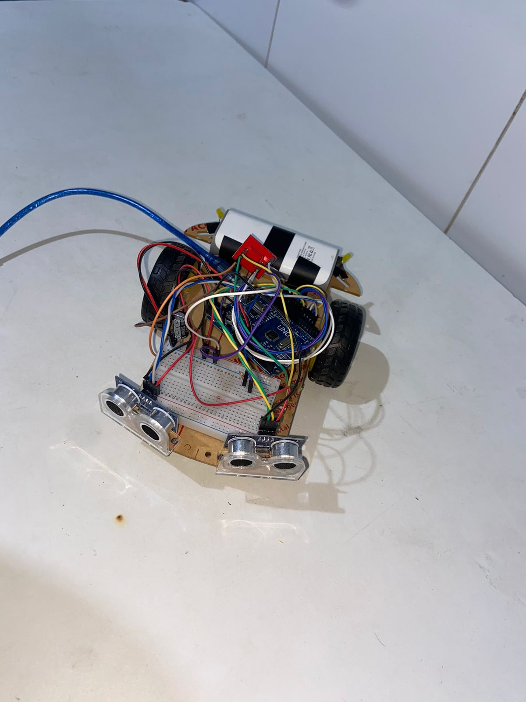
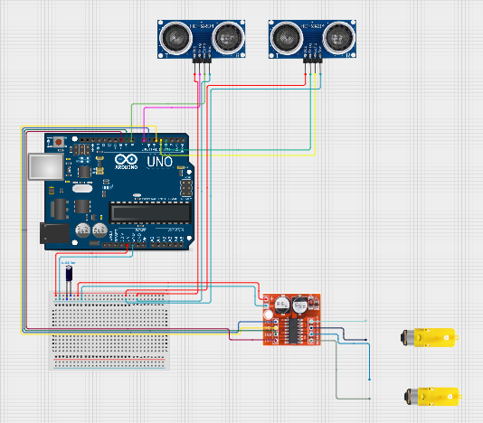

# Carrinho_autonomo

## Imagem do Projeto

## Descrição
Projeto de um carrinho que consegue desviar de obstáculos. Feito com a plataforma arduino e que utiliza
sensores ultrassônicos para detectar obstáculos. O carrinho é capaz de navegar pelo ambiente sem bater 
em nada.

## Funcionalidades
* Movimentação autônoma;
* Detecção de obstáculos a uma distância pré-definida (20cm);
* Lógica de decisão para tomar a melhor rota de desvio.

## Componentes Utilizados
* 1x Placa Arduino uno;
* 2x Motores DC com caixa de redução;
* 1x Mini driver ponte H L298N;
* 1x Capacitor 1000uF
* 2x Leds amarelos
* 2x Resistores 10KOhms
* 1x Chassi 2wd acrílico
* 1x Roda boba

## Esquema de ligação

## Lógica
1. Inicia o loop
2. Lê os sensores
3. Se a distância for maior que 20cm, move o carrinho para frente
4. Senão
  a. Para os motores
  b. Gira para trás o motor do lado oposto ao sensor que captou o obstáculo
5. Repete o loop

## Desafios e aprendizado
Inicialmente as leituras dos sensores eram instáveis, pois utilizei a biblioteca HCSR04.h, que não me dava uma 
distância tão precisa. Para resolver isso fiz a lógica da leitura manualmente e aumentei a distância de detecção 
de obstáculos. Os motores também não respondiam bem no começo. Para resolver coloquei um capacitor em paralelo para 
melhorar o fluxo de energia.

## Futuras melhorias
* Criação de um sistema de alimentação com pilhas
* Adição de mais funcionalidades
